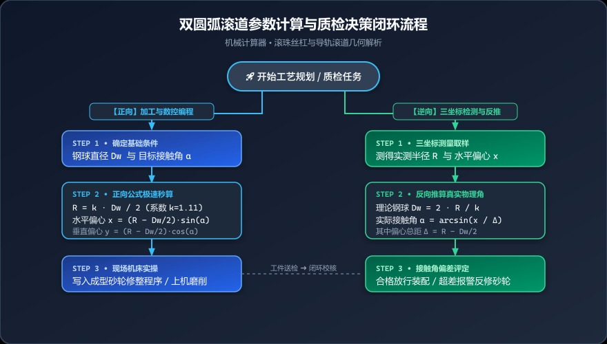

# 滚珠丝杠双圆弧滚道总卡死？一文吃透曲率比、偏心与接触角正反向逆推！

> **导读**：在滚珠丝杠副和直线导轨的制造中，双圆弧（哥特式）滚道不仅决定了传动刚度与承载能力，更是预紧控制的生命线。但现场常遇尴尬：设计只标了钢球和接触角，磨床数控宏程序却需要圆弧中心偏心坐标；三坐标测出了半径和偏心，却反推不出真实接触角……本文将用深入浅出的几何图解、严谨公式推导与在线计算工具，彻底打破这一技术壁垒！

---

## 一、车间翻车现场：为什么你的丝杠“手感发涩”甚至直接卡死？

很多从事滚珠丝杠磨削的工艺员和调机师傅都曾遇到过这样的抓狂时刻：

* **场景 A**：根据设计图纸标的钢球直径 $D_w = 3.175\text{ mm}$、公称接触角 $\alpha = 45^\circ$ 上机修整砂轮成型面，结果磨出来的工件装配预紧后，**转动阻力矩严重超标**，局部甚至有顿挫卡滞感；
* **场景 B**：品管室拿三坐标打完截面圆弧，报告单上只有一串生硬的数据：`圆弧半径 R = 1.762mm`、`水平偏心 X = 0.123mm`。工艺员拿着报告一脸茫然：“那这批零件的实际接触角到底合不合格？预紧力衰减了多少？”

问题究竟出在哪里？
根源就在于**双圆弧滚道参数的非线性几何几何关联**。在双圆弧接触模型中，曲率半径系数、偏心量与接触角环环相扣，人工查表或简易近似算法往往会丢失微米级精度，最终在工件上放大为致命的装配缺陷！

---

## 二、图解双圆弧：一分钟看清几何奥秘

什么是双圆弧（哥特式 Arch）滚道？它与普通的单圆弧滚道最大的不同，在于它是由两个**圆心不对称偏移的圆弧**在底部相交而成，使得钢球在受载时形成**两点接触（或预紧四点接触）**。

### 核心参数定义对照表

| 符号 | 参数名称 | 工程意义与现场角色 |
|:---:|:---|:---|
| **$D_w$** | 钢球直径 (Ball Diameter) | 滚动体规格，通常为标准公制或英制滚珠 |
| **$k$ (coe)** | 曲率半径系数 (Curvature Coefficient) | 决定滚道贴合度，常规取 $1.05 \sim 1.15$（推荐标准常数 $1.11$） |
| **$R$** | 滚道圆弧半径 (Arc Radius) | 砂轮成型修整圆弧半径、三坐标拟合半径 |
| **$\alpha$** | 接触角 (Contact Angle) | 载荷方向角，常见为 $40^\circ, 45^\circ$ |
| **$x$** | 水平偏心量 (Horizontal Offset) | 滚道圆心相对钢球中心/基准线的水平偏移 |
| **$y$** | 垂直偏心量 (Vertical Offset) | 滚道圆心相对钢球中心/基准线的垂直偏移 |
| **$\Delta$** | 偏心总距 (Center Distance) | 圆弧圆心与钢球球心的理论中心连线长度 |

---

## 三、数学解析：正向推算与反向逆推的底层公式

### 1. 正向计算（已知：标准系数 $k$、钢球直径 $D_w$、接触角 $\alpha$ $\rightarrow$ 求圆弧半径与偏心）

在设计滚道轮廓、编写数控磨床修整滚轮宏程序时，我们需要精确推导出滚道圆弧的半径及其圆心坐标偏移：

1. **滚道圆弧半径 $R$**：
   $$R = \frac{k \cdot D_w}{2}$$
2. **中心距偏差 $\Delta$**（滚道圆心至钢球中心的距离）：
   $$\Delta = R - \frac{D_w}{2} = (k - 1) \cdot \frac{D_w}{2}$$
3. **水平偏心量 $x$**：
   $$x = \Delta \cdot \sin\alpha = \left(R - \frac{D_w}{2}\right) \cdot \sin\alpha$$
4. **垂直偏心量 $y$**：
   $$y = \Delta \cdot \cos\alpha = \left(R - \frac{D_w}{2}\right) \cdot \cos\alpha$$

> 💡 **重点解析**：从公式可见，偏心总距 $\Delta$ 完全由曲率系数 $k$ 和钢球直径 $D_w$ 决定；而水平与垂直偏心，则是总偏心距在接触角方向上的三角函数正交投影。

---

### 2. 反向逆推（已知：圆弧半径 $R$、水平偏心 $x$、标准系数 $k$ $\rightarrow$ 反求钢球直径 $D_w$ 与接触角 $\alpha$）

在车间测量检验、修磨改制旧滚道或反向测绘未知滚道时，三坐标测量仪通常只能测出滚道轮廓的拟合圆弧半径 $R$ 和水平偏心 $x$。此时必须反向推导：

1. **反求理论钢球直径 $D_w$**：
   $$D_w = \frac{2R}{k}$$
2. **反求实际接触角 $\alpha$**：
   根据 $x = \left(R - \frac{D_w}{2}\right) \cdot \sin\alpha$，移项得：
   $$\sin\alpha = \frac{x}{R - \frac{D_w}{2}}$$
   $$\alpha = \arcsin\left(\frac{x}{R - \frac{D_w}{2}}\right) \times \frac{180^\circ}{\pi}$$
3. **校核垂直偏心量 $y$**：
   $$y = \left(R - \frac{D_w}{2}\right) \cdot \cos\alpha$$

> ⚠️ **红线警示**：若输入的水偏心 $x$ 超过了理论最大偏心距 $\Delta = (R - D_w/2)$，即 $\frac{x}{\Delta} > 1$，数学上 $\arcsin$ 无解（在程序中表现为 `NaN`），在机械物理上则意味着**该几何形态下钢球根本无法与圆弧形成预期的接触切点**，说明测绘数据存在严重失真或工件已过度过切！

---

## 四、全生命周期计算与质检决策流程图

在数字化磨削车间中，正向计算指导生产，反向推算指导质检，形成闭环：

  

    📊 工艺决策与质检闭环全景流程速览
  

  

    
🔵 【正向】设计制造与数控编程路线

    

      <strong>1. 基础输入：</strong>确定图纸钢球直径 <code>Dw</code> 与设计接触角 <code>α</code>； 
      <strong>2. 系数选定：</strong>选定曲率系数 <code>k</code>（标准推荐值 1.11）； 
      <strong>3. 秒算参数：</strong>求得圆弧半径 <code>R = k · Dw / 2</code>，水平偏心 <code>x = (R - Dw/2) · sin(α)</code>，垂直偏心 <code>y = (R - Dw/2) · cos(α)</code>； 
      <strong>4. 机床执行：</strong>将 R 与中心偏心写入成型砂轮修整宏程序，开机精密磨削。
    

  

  

    
🟢 【逆向】三坐标检测与质量判定路线

    

      <strong>1. 现场实测：</strong>三坐标/轮廓仪打表，获得实测半径 <code>R</code> 与水平偏心 <code>x</code>； 
      <strong>2. 反向推导：</strong>反求理论钢球直径 <code>Dw = 2 · R / k</code>，计算偏心总距 <code>Δ = R - Dw/2</code>； 
      <strong>3. 接触角求取：</strong>计算真实接触角 <code>α = arcsin(x / Δ)</code>； 
      <strong>4. 判定决策：</strong>接触角在允许公差带（如 ±1°）内则放行装配；若超差则停机补偿修整砂轮。
    

  

---

## 五、手把手实战案例演算

我们以规格 `3205` 的高精密滚珠丝杠滚道加工为例：

* **设计输入条件**：
  * 钢球直径 $D_w = 3.175\text{ mm}$
  * 设计接触角 $\alpha = 45^\circ$
  * 行业标准曲率比系数 $k = 1.11$

### 1. 正向计算推导
1. 计算圆弧半径 $R$：
   $$R = \frac{1.11 \times 3.175}{2} = 1.7621\text{ mm}$$
2. 计算偏心总距 $\Delta$：
   $$\Delta = 1.7621 - \frac{3.175}{2} = 1.7621 - 1.5875 = 0.1746\text{ mm}$$
3. 计算水平偏心量 $x$：
   $$x = 0.1746 \times \sin(45^\circ) = 0.1746 \times 0.707107 \approx 0.1235\text{ mm}$$
4. 计算垂直偏心量 $y$：
   $$y = 0.1746 \times \cos(45^\circ) = 0.1746 \times 0.707107 \approx 0.1235\text{ mm}$$

### 2. 反向质检验证
假设三坐标测量反馈实际磨出的滚道参数为：
* $R = 1.7621\text{ mm}$
* $x = 0.1235\text{ mm}$
* 系数仍按 $1.11$

在反向推算面板中输入上述数值：
* 反算钢球直径：$D_w = \frac{1.7621 \times 2}{1.11} = 3.1750\text{ mm}$
* 反算接触角：$\alpha = \arcsin\left(\frac{0.1235}{1.7621 - 1.5875}\right) = \arcsin(0.7073) \approx 45.02^\circ$
* 结果几乎完全吻合，证明滚道修整轮廓精度达到微米级！

---

## 六、老工程师的私房避坑指南

1. **别拿 $1.11$ 当绝对金科玉律**：
   虽然默认 $1.11$ 是兼顾接触刚度与摩擦寿命的黄金平衡点，但在超重载滚珠丝杠或微型微导轨上，系数可能调整为 $1.08$（重载、接触面积大、摩擦略大）或 $1.15$（高频轻载、低发热、摩擦阻力小）。调机前一定要核实企业标准。
2. **左右滚道对称性陷阱**：
   在单轴磨削双圆弧时，若砂轮轴向对刀零点漂移哪怕 $5\,\mu\text{m}$，就会造成左侧水平偏心大于右侧，表现为钢球“单边承载受挤压”，运转时异响明显。必须严格保证左右滚道水平偏心 $x$ 对称。
3. **三坐标测量的拟合半径伪差**：
   双圆弧在谷底存在相交过渡带（非有效接触区），如果三坐标采点时将非接触谷底的圆角一并拟合，会导致测出的 $R$ 偏大。**务必仅在有效接触圆弧段（接触角前后 $\pm 15^\circ$ 范围内）进行圆弧拟合采点！**

---

## 七、一键体验在线计算神器

不再需要拿计算器狂按三角函数，也不必担心手算打错小数点！
打开我们的**【机械计算器 ➜ 双圆弧参数】**工具：

* ✅ **预设系数下拉**：内置 $1.05 \sim 1.15$ 工业常用系数，支持任意自定义输入；
* ✅ **正向反向双面板**：左侧算编程参数，右侧算品检数据，自动互推；
* ✅ **手机端极速响应**：支持移动端自动平滑滚动定位，车间机床前掏出手机 3 秒得出精准结果！

👉 **在线计算工具直达**：[https://mechanical-calculator.niekun.net/](https://mechanical-calculator.niekun.net/)

*（欢迎在评论区分享：你们厂里加工双圆弧滚道，接触角公差一般卡在多少度以内？）*

---

#滚珠丝杠 #双圆弧滚道 #哥特式滚道 #接触角计算 #精密磨削 #机械设计 #数控加工 #三坐标检测
