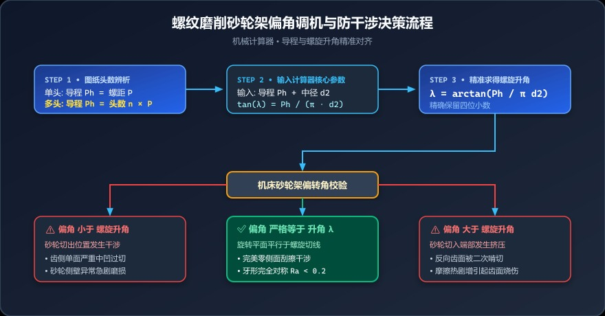

# 多头丝杠磨削总有齿形畸变？老磨工教你如何精准对齐螺旋升角


> **导读**：在高精密丝杠、多头蜗杆或梯形丝母的磨削与车削加工中，你是否常遇到这样的怪事：数控程序明明分毫不差，砂轮也修整得极为规整，但磨出来的牙形一打投影仪，齿侧却明显中凹变形，甚至单侧发黑烧伤？别急着怀疑刀具或砂轮，十有八九是机床的砂轮架偏角（B轴）与工件的**螺旋升角**没有精准对齐！

---

## 一、车间翻车实录：螺距与导程搞混，万元工件瞬间报废

“师傅，这根四头滚珠丝杠，我砂轮架明明按图纸上的螺距 $P = 5\text{ mm}$ 算了角度偏了过去，怎么磨第一刀，砂轮右侧就冒大火花，工件直接啃出一个大凹槽？”

这是一位新进厂的年轻调机员曾经犯过的经典错误。
排查发现：图纸上标明的是**四头丝杠**，螺距 $P = 5\text{ mm}$，那么它的**导程（Lead）其实是 $5 \times 4 = 20\text{ mm}$**！
他把导程当成了螺距，算出来的螺旋升角生生小了将近 4 倍！高速旋转的砂轮外缘在进刀瞬间产生极其严重的空间干涉，整根毛坯当场报废。

**螺旋升角（Lead Angle）**看似只是一个基础几何角，但它是连接机床机械坐标系与空间螺旋曲线的唯一桥梁。一旦算错，哪怕只差 $0.1^\circ$，就会引起致命的齿形畸变与干涉过切。

---

## 二、几何图解：一秒把空间螺旋线“铺平”

要彻底吃透螺旋升角，最好的方法是——**将工件中径所在的圆柱面沿母线剪开，展开成一个平面**！

```text
               空间螺旋线在圆柱表面的展开图

    ▲
    │                                              /|
    │                                             / │
    │                                            /  │
    │                                           /   │
    │                                          /    │
导程 │                                         /     │
P_h │                                        /      │ 导程 P_h
    │                                       /       │
    │                                      /        │
    │                                     /         │
    │                                    / λ (升角) │
    └───────────────────────────────────/___________│─────►
             ◄─────────── π · d_2 ──────────►
                     中径圆周长展开
```

展开之后，空间复杂的螺旋线瞬间变成了一个标准的**直角三角形**：
* **底边**：工件中径圆周长 $L_{circle} = \pi \times d_2$
* **对边**：工件每旋转一整圈，轴向前进的物理距离——**导程 $P_h$**
* **斜边**：螺旋线的展开轨迹
* **底边与斜边的夹角 $\lambda$**：这就是我们必须精确设定的**螺旋升角（Lead Angle）**！

---

## 三、数学解析：核心公式与关键概念辨析

### 1. 核心数学计算公式

根据直角三角形三角函数关系：
$$\tan\lambda = \frac{\text{导程 } P_h}{\text{中径周长 } \pi d_2} = \frac{P_h}{\pi \cdot d_2}$$

由此解出螺旋升角 $\lambda$（单位：度）：
$$\lambda = \arctan\left(\frac{P_h}{\pi \cdot d_2}\right) \times \frac{180^\circ}{\pi}$$

---

### 2. 致命易混淆点：螺距（Pitch） vs 导程（Lead）

这是 80% 的新手最容易踩空的坑：

| 术语 | 符号 | 定义 | 关联关系 |
|:---|:---:|:---|:---|
| **螺距 (Pitch)** | $P$ | 相邻两牙在中径线上对应两点间的轴向距离 | 基础几何单元 |
| **头数 / 线数 (Threads)** | $n$ (或 $z$) | 螺纹或螺旋槽的独立螺旋线数量 | 必须为正整数 ($1, 2, 3, \dots$) |
| **导程 (Lead)** | $P_h$ | 工件旋转 $360^\circ$（一整周）螺纹沿轴向推进的位移 | **$P_h = n \times P$** |

> 📌 **老磨工金句**：
> * 单头螺纹：导程 = 螺距（$P_h = P$）
> * 多头螺纹：**导程 = 头数 $\times$ 螺距（$P_h = n \cdot P$）**，算螺旋升角必须用**导程**！

---

## 四、为什么砂轮架必须严格对齐螺旋升角？



<div style="background: #f8fafc; border: 1px solid #e2e8f0; border-radius: 12px; padding: 18px; margin: 16px 0;">
  <div style="font-weight: bold; color: #0f172a; margin-bottom: 12px; font-size: 15px; display: flex; align-items: center; gap: 8px;">
    <span>⚙️</span> 砂轮偏角与螺旋升角匹配状态对比表
  </div>
  <div style="background: #ecfdf5; border: 1px solid #a7f3d0; border-radius: 8px; padding: 12px; margin-bottom: 10px;">
    <div style="font-weight: bold; color: #047857; font-size: 13px; margin-bottom: 4px;">✅ 偏角 严格等于 升角 λ</div>
    <div style="font-size: 12px; color: #334155; line-height: 1.5;">
      砂轮回转面与螺旋槽切线完全平行；零侧面干涉，牙形对称且粗糙度 Ra &lt; 0.2。
    </div>
  </div>
  <div style="background: #fef2f2; border: 1px solid #fecaca; border-radius: 8px; padding: 12px; margin-bottom: 10px;">
    <div style="font-weight: bold; color: #b91c1c; font-size: 13px; margin-bottom: 4px;">⚠️ 偏角 小于 升角 λ</div>
    <div style="font-size: 12px; color: #334155; line-height: 1.5;">
      砂轮切出端干涉包络过切；右侧齿面中凹超差，砂轮侧壁异常磨损发热。
    </div>
  </div>
  <div style="background: #fff7ed; border: 1px solid #fed7aa; border-radius: 8px; padding: 12px;">
    <div style="font-weight: bold; color: #c2410c; font-size: 13px; margin-bottom: 4px;">⚠️ 偏角 大于 升角 λ</div>
    <div style="font-size: 12px; color: #334155; line-height: 1.5;">
      砂轮切入端过切挤压；左侧齿面受损，磨削热剧增引起齿面局部退火烧伤。
    </div>
  </div>
</div>

* **包络干涉效应**：当大直径砂轮切入深槽时，只有旋转平面与工件瞬时螺旋切线严格一致，砂轮切削刃修整出的几何母线才能在工件轴向截面上准确投影出标准齿形；
* **非线性畸变**：一旦偏角失真，砂轮圆弧面将在工件齿侧“二次啃切”，出现微观双曲面凸起或凹陷，导致滚珠在滚道中运行受力不均，极早产生剥落失效。

---

## 五、全流程调机实战决策流程图

<div style="background: #eff6ff; border: 1px solid #bfdbfe; border-radius: 10px; padding: 16px; margin: 16px 0;">
  <div style="font-weight: bold; color: #1e40af; font-size: 14px; margin-bottom: 8px;">📋 车间标准调机实操四步法</div>
  <div style="font-size: 13px; color: #1e293b; line-height: 1.7;">
    1. <strong>核实头数与导程：</strong>单头工件 <code>Ph = P</code>，多头工件务必相乘 <code>Ph = n × P</code>；<br/>
    2. <strong>获取基准中径：</strong>准确测量或从公差表查取理论工件中径 <code>d2</code>；<br/>
    3. <strong>输入秒算角度：</strong>打开计算器一键计算 <code>tan(λ) = Ph / (π · d2)</code>，获取精确升角；<br/>
    4. <strong>对齐机床并试切：</strong>数控机床直接输入 B 轴变量，手动磨床以正弦规千分表打表调角，首件试刀确认对称度。
  </div>
</div>

<details>
<summary><b>🔍 点击展开查看 Mermaid 流程图原生代码</b></summary>


</details>

---

## 六、手把手实战案例演算

我们以一根精密数控机床使用的**多头高速滚珠丝杠**为例：

* **工件参数**：
  * 头数 $n = 4$
  * 轴向螺距 $P = 6\text{ mm}$
  * 工件公称外径 $40\text{ mm}$，查得中径 $d_2 = 37.5\text{ mm}$

### 1. 计算导程
$$P_h = n \times P = 4 \times 6 = 24\text{ mm}$$

### 2. 计算中径展开圆周长
$$L = \pi \times d_2 \approx 3.14159265 \times 37.5 \approx 117.8097\text{ mm}$$

### 3. 计算正切值与螺旋升角
$$\tan\lambda = \frac{24}{117.8097} \approx 0.203718$$
$$\lambda = \arctan(0.203718) \approx 11.5165^\circ$$

即：机床的砂轮架偏角必须精确调整至 **$11.5165^\circ$**（在普通刻度机床上约等于 $11^\circ 31'$）。

---

## 七、调机师傅经验秘籍与避坑清单

1. **左旋与右旋的符号方向**：
   * 右旋螺纹（顺时针拧紧）：砂轮架按正向（通常为顺时针）偏转；
   * 左旋螺纹（逆时针拧紧）：砂轮架必须向反方向（逆时针）偏转！
   * 调机前务必拿手摸一摸、看一看工件旋向，千万别把左旋调成了右旋角度。
2. **大升角大直径砂轮的“理论干涉修正”**：
   当工件螺旋升角较大（例如 $\lambda > 15^\circ$），且使用的砂轮外径相对工件中径较大时（如砂轮 $\Phi 400\text{ mm}$ 磨削 $\Phi 30\text{ mm}$ 丝杠），单纯偏转螺旋升角仍会存在微量的干涉包络变形。高端磨床需采用专门的**成型砂轮修整补偿算法**对砂轮修整截面进行反求。
3. **中径必须使用实际理论中径**：
   有的操作工偷懒直接用外径代替中径代入计算，外径偏大导致算出来的角度偏小，尤其在深牙型梯形螺纹和蜗杆加工中，外径与中径差异巨大，绝对不能图省事替代！

---

## 八、一键使用在线秒算工具

打开我们的**【机械计算器 ➜ 螺旋升角】**模块：
* 界面极简清晰：只需输入**工件导程**与**工件中径**；
* 秒级显示保留四位小数的高精度角度结果；
* 配合机床宏程序直接调用，省去手工翻三角函数表和弧度转换的麻烦。

👉 **在线计算工具直达**：[https://mechanical-calculator.niekun.net/](https://mechanical-calculator.niekun.net/)

*（在留言区聊聊：你们在车间磨削过多大升角的丝杠？调机时遇到过因角度不对产生的奇怪振纹吗？）*

---

#螺旋升角 #导程与螺距 #滚珠丝杠 #多头螺纹 #螺纹磨削 #精密加工 #数控调机 #机械工程
