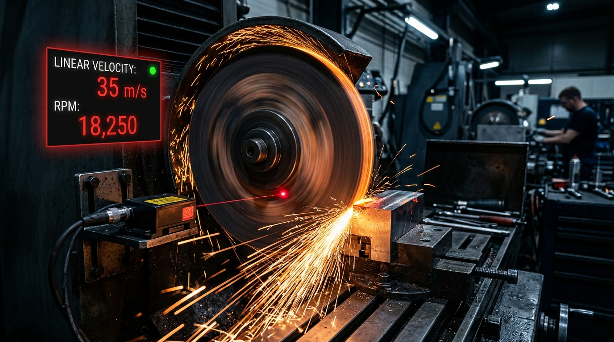
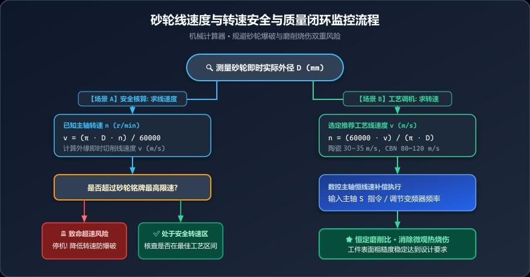
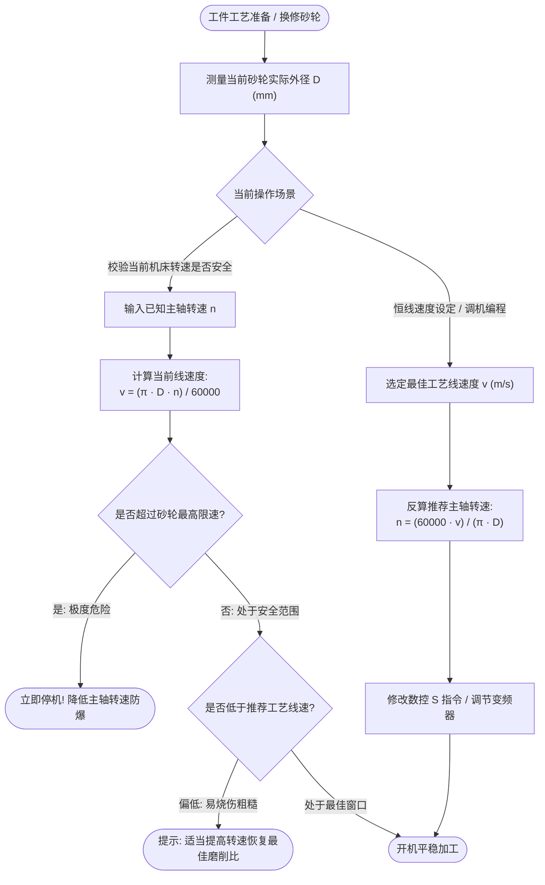

# 砂轮越修越小工件频频烧伤？从线速度断崖到防爆破的安全转速红线



> **导读**：在机械加工车间里，磨削往往是精密零件加工的“最后一道工序”。但你是否经历过这样的怪现象：刚换新砂轮时磨出来的零件光亮如镜，用了一两周、砂轮修整过几次后，同样的进刀量，工件表面却开始出现发黄发黑的磨削烧伤，甚至振纹丛生？更有甚者，换上大外径新砂轮开机瞬间，只听“轰”的一声——砂轮发生骇人听闻的爆裂碎飞！这一切惨痛教训的背后，都逃不开一个最基础、却最致命的物理量：**砂轮线速度（m/s）与主轴转速（RPM）的动态换算**。

---

## 一、真实惨痛教训：为什么说线速度既是“质量命门”，更是“生死红线”？

### 1. 质量痛点：直径缩水带来的“线速度断崖”
一砂轮出厂外径是 $\Phi 400\text{ mm}$，机床定速在 $1670\text{ RPM}$，此时线速度约为标准的 $35\text{ m/s}$。
经过两周高强度生产与频繁金刚石滚轮修整，砂轮外径磨损消耗到了 $\Phi 260\text{ mm}$。
如果操作工未调整主轴转速，线速度将骤降至 **$22.7\text{ m/s}$**！
线速度暴跌导致**单颗磨粒的切削负荷成倍剧增**，原本能够正常微刃破碎自锐的砂轮瞬间钝化、剧烈摩擦发热，高价值齿轮和丝杠直接大面积表面金相退火、烧伤报废！

### 2. 安全死线：超速飞砂的爆炸冲击
曾有车间在老式磨床上将小砂轮换成大砂轮，未核实机床皮带轮挡位。额定最高线速度 $35\text{ m/s}$ 的陶瓷砂轮，实际转速让线速度冲到了惊人的 $55\text{ m/s}$。在巨大离心力作用下，高速旋转的砂轮瞬间撕裂炸飞，直接洞穿钣金护罩！

**不懂线速度与转速换算的磨工，就像开着没有限速表的赛车在悬崖狂奔！**

---

## 二、直观图解：圆周运动与表面线速度的几何本质

```text
               主轴高速旋转 (n: r/min)
                    ┌─────┐
                    │ 主轴│
                    └──┬──┘
                       │
             .─────────┴─────────.
          .'                       '.
        /                             \
       │         砂轮基体              │
      │        (外径: D mm)             │
──────┼─────────────────●───────────────┼──────► 旋转切线方向
      │                 │               │        线速度 v (m/s)
       │                │              │
        \               │             /
          '.            │          .'
             '──────────┴─────────'
                        ▲
                        │ 磨削接触弧区
                        ▼
                 =================
                   被加工工件材料
```

* **主轴转速 $n$ (RPM)**：机床主轴每分钟转动的圈数；
* **砂轮外径 $D$ (mm)**：磨削接触点的即时物理外径；
* **切削线速度 $v$ (m/s)**：砂轮最外缘磨粒在切削接触瞬间的真实移动线速度。它直接决定了磨粒与金属工件之间的微观切除物理过程！

---

## 三、数学推导：公式虽简单，背后的量纲必须严谨

### 1. 从转速 $n$ 到线速度 $v$ 的推导

砂轮旋转一整圈，其外圆周长走过的距离为：
$$C = \pi \times D\text{ (单位: mm)} = \frac{\pi \cdot D}{1000}\text{ (单位: 米 m)}$$

主轴每分钟转动 $n$ 圈，即每秒钟转动的圈数为：
$$f = \frac{n}{60}\text{ (单位: 圈/秒)}$$

因此，砂轮外缘每秒钟划过的米数（即切削线速度 $v$）：
$$v = \frac{n}{60} \times \frac{\pi \cdot D}{1000} = \frac{\pi \cdot D \cdot n}{60000}\text{ (m/s)}$$

---

### 2. 从目标线速度 $v$ 反求机床转速 $n$

在工艺编程或调整变频器频率时，我们通常根据工艺手册确定工件材质推荐的最佳磨削线速度 $v$（例如淬火钢要求 $30\sim 35\text{ m/s}$），此时需要反向求取机床设定转速：

$$n = \frac{60000 \cdot v}{\pi \cdot D}\text{ (r/min)}$$

> 💡 **公式速记常数**：
> $\pi \approx 3.14159$，$\frac{60000}{\pi} \approx 19098.6$
> 现场心算速记口诀：
> $$n \approx \frac{19100 \times v}{D}$$

---

## 四、重点解析：不同磨料结合剂的安全与工艺速度窗口

不同材质的砂轮，其物理结合强度和自锐机制截然不同。千万不能“一视同仁”：

| 砂轮类型 | 结合剂材质 | 典型推荐工作线速度 ($v$) | 最高安全极限红线 | 工艺特点与风险警示 |
|:---|:---|:---:|:---:|:---|
| **普通陶瓷砂轮** | 刚玉 / 碳化硅 (Vit) | $30 \sim 35\text{ m/s}$ | **$40\text{ m/s}$** | 最常用，抗拉强度低、脆性大，绝对严禁超速，遇磕碰裂纹必炸 |
| **重负荷树脂砂轮** | 树脂结合剂 (BF/B) | $50 \sim 80\text{ m/s}$ | **$100\text{ m/s}$** | 韧性好、耐冲击，多用于重负荷切断与粗磨，易老化受潮 |
| **超硬 CBN 陶瓷砂轮** | 立方氮化硼 (CBN) | $60 \sim 120\text{ m/s}$ | 视钢基体等级而定 | 高效强力深切磨削，需要高刚度高防振机床，寿命极长 |
| **电镀金刚石/CBN** | 金属电镀基体 | $30 \sim 80\text{ m/s}$ | 视动平衡等级而定 | 成型精度高，基体为合金钢，耐冲击但不耐过高磨削热 |

> ⚠️ **深度机理**：
> * **线速度偏低**：每个磨粒承担的切屑厚度增大，切削阻力骤增，磨粒容易过早大块脱落，砂轮外形快速失真，工件粗糙度变粗；
> * **线速度偏高但未超限**：磨粒微刃自锐良好，工件表面光洁度大幅提升；
> * **线速度过高超限**：摩擦加剧导致磨削区温度急剧升高（可达 $1000^\circ\text{C}$ 以上），工件产生二次淬火层或退火软化，甚至诱发微观热应力裂纹！

---

## 五、车间全闭环安全与质量监控流程图



<div style="background: #f8fafc; border: 1px solid #e2e8f0; border-radius: 12px; padding: 18px; margin: 16px 0;">
  <div style="font-weight: bold; color: #0f172a; margin-bottom: 12px; font-size: 15px; display: flex; align-items: center; gap: 8px;">
    <span>🛡️</span> 车间砂轮转速与线速度安全管理闭环卡
  </div>
  <div style="background: #eff6ff; border-left: 4px solid #3b82f6; padding: 12px; border-radius: 6px; margin-bottom: 10px;">
    <div style="font-weight: bold; color: #1d4ed8; font-size: 13px; margin-bottom: 6px;">🔵 场景 1：安全验算（查转速求线速度）</div>
    <div style="font-size: 12px; color: #334155; line-height: 1.6;">
      • 输入砂轮实际外径 <code>D</code> 与当前主轴转速 <code>n</code>；<br/>
      • 实时计算线速度 <code>v = (π · D · n) / 60000</code>；<br/>
      • <strong>红线核验：</strong>若超过砂轮铭牌极限速度（如普通陶瓷 35m/s），立即停机降速，防止爆裂！
    </div>
  </div>
  <div style="background: #ecfdf5; border-left: 4px solid #10b981; padding: 12px; border-radius: 6px;">
    <div style="font-weight: bold; color: #047857; font-size: 13px; margin-bottom: 6px;">🟢 场景 2：恒线速调机（查线速度求转速）</div>
    <div style="font-size: 12px; color: #334155; line-height: 1.6;">
      • 砂轮修整后直径 <code>D</code> 变小，按工艺推荐线速度（如 35m/s）反算；<br/>
      • 设定转速 <code>n = (60000 · v) / (π · D)</code>；<br/>
      • <strong>质量收益：</strong>补偿线速度跌落，维持最佳磨削比，彻底消除工件表面退火烧伤。
    </div>
  </div>
</div>

<details>
<summary><b>🔍 点击展开查看 Mermaid 流程图原生代码</b></summary>



</details>

---

## 六、手把手实操案例演算

### 案例 A：砂轮磨损后的转速补偿（质量保证）
* **现状**：外圆磨床使用陶瓷白刚玉砂轮，新砂轮直径 $400\text{ mm}$，机床设定转速 $1670\text{ RPM}$，线速度 $34.98\text{ m/s}$。
* **磨损后**：砂轮修整后测量外径缩小为 $310\text{ mm}$。若保持 $35\text{ m/s}$ 最佳线速度，应将机床转速调整为多少？
* **演算**：
  $$n = \frac{60000 \times 35}{\pi \times 310} = \frac{2100000}{973.89} \approx 2156\text{ RPM}$$
* **结论**：主轴转速必须从 $1670\text{ RPM}$ 提升至 **$2156\text{ RPM}$**，才能消除工件发黄烧伤缺陷。

### 案例 B：超速安全防爆核查（安全保命）
* **现状**：操作工要在内圆磨床上安装一片外径 $D = 50\text{ mm}$ 的小砂轮，砂轮铭牌标注最高安全线速度为 $35\text{ m/s}$。电主轴当前设定的转速为 $18000\text{ RPM}$。请问是否安全？
* **演算**：
  $$v = \frac{\pi \times 50 \times 18000}{60000} = \frac{2827433}{60000} \approx 47.12\text{ m/s}$$
* **惊魂结论**：实际线速度高达 **$47.12\text{ m/s}$**，远超安全红线 $35\text{ m/s}$（超速达 $34.6\%$）！一旦开机进刀必将爆裂！必须立即将主轴转速限制在 $13369\text{ RPM}$ 以下！

---

## 七、调机师傅的私房避坑心得

1. **新换砂轮严禁直接开最高速**：
   无论多么紧急，新砂轮安装法兰拧紧后，必须在有防护罩的前提下**空转试跑 3~5 分钟**。在没有受切削力前检验是否有隐蔽内伤裂纹；
2. **警惕“假恒线速度”**：
   部分带有恒线速度（CSS）功能的数控机床，如果操作工输入了错误的初始砂轮外径变量，系统自动换算的转速就会全盘错误！必须养成修整完砂轮后**用卡尺复核外径并修改系统参数**的肌肉记忆；
3. **皮带传动老机床的档位检查**：
   没有变频调速的老旧磨床通常采用塔轮皮带传动，每次更换大规格砂轮时，第一动作就是拆开皮带罩，核对皮带是不是挂在低速档！

---

## 八、一秒在线换算神器

掏出手机，打开我们的**【机械计算器 ➜ 线速度 ↔ 转速】**模块：
* **双向极速联动**：顶部输入砂轮直径作为基准，左侧输入转速算线速度，右侧输入线速度反求转速；
* **界面自动高亮**：计算结果清晰大字呈现，手机端自动智能滚动聚焦结果面板；
* 让安全核算与工艺设定在 2 秒钟内完成，彻底告别盲猜！

👉 **在线计算工具直达**：[https://mechanical-calculator.niekun.net/](https://mechanical-calculator.niekun.net/)

*（在留言区说说看：你们车间发生过因为砂轮用小后烧伤工件的经历吗？你们主轴支持变频自动恒线速吗？）*

---

#砂轮线速度 #磨削转速 #外圆磨削 #内圆磨削 #砂轮防爆 #磨削烧伤 #数控磨床 #安全生产
