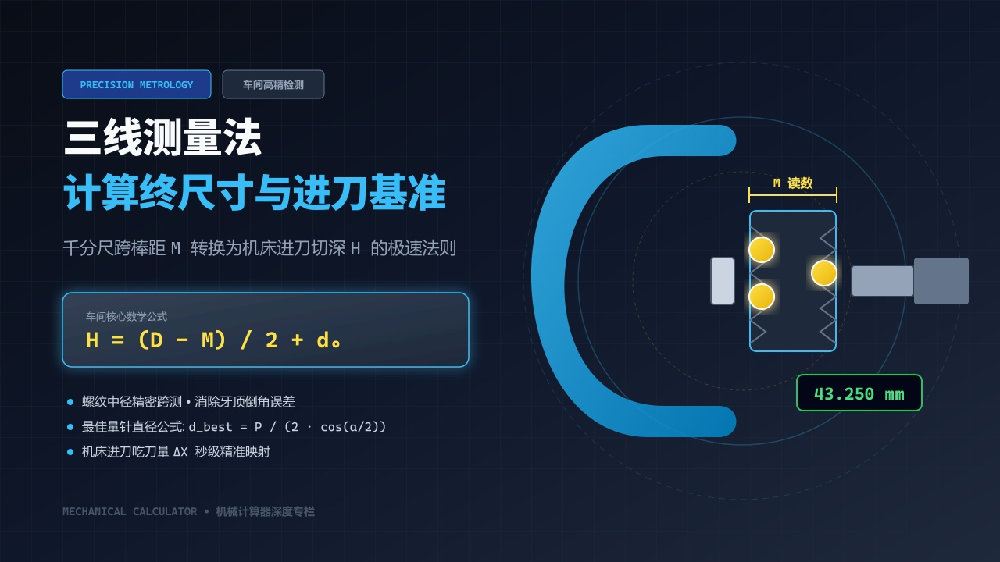
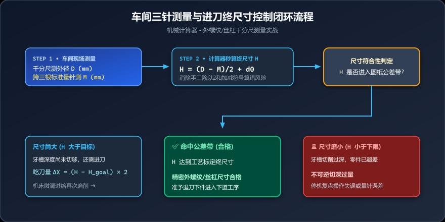
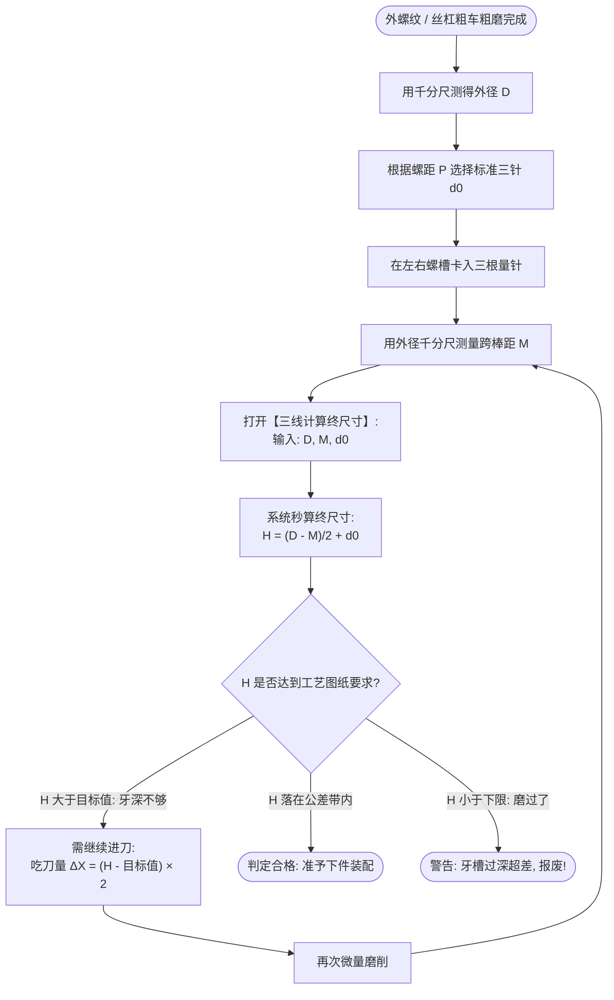

# 千分尺跨棒距测出来了，怎么换算进刀终尺寸？车间三针测量极速计算法则



> **导读**：在精密外螺纹、梯形丝杠、蜗杆及滚珠滚道的加工中，中径精度往往要求控制在 $0.005\text{ mm}$ 以内。直接用千分尺测外径无法反映牙槽配合深度，三坐标又无法频繁在机检测。车间最经典的“质检神器”莫过于——**三线测量法（三针量法）**。然而很多现场磨工和车工测出千分尺读数 $M$ 之后，在机床边草稿纸上算进刀终尺寸 $H$，手一抖把除以 2 漏掉或加减符号搞反，一刀下去就超差报废！今天我们彻底拆解三线法终尺寸的几何本源与秒算技巧。

---

## 一、车间实战痛点：千分尺读数和机床进刀量脱节

在磨床上磨削一根精密滚珠丝杠：
1. 操作工把三根精密量针放置在左右牙槽内，拿起外径千分尺，手感轻轻滑过量针外径，读出一个跨测读数：$M = 43.250\text{ mm}$；
2. 图纸要求工件名义外径 $D = 40.000\text{ mm}$，量针直径 $d_0 = 3.500\text{ mm}$；
3. 此时徒弟问师傅：“师傅，千分尺打了 $43.250$，那我数控系统 X 轴现在到底还要再切深多少丝？终尺寸高度 $H$ 到底算多少？”
4. 师傅抓起铅笔在机床罩壳上边算边涂改：$(40 - 43.25)/2 + 3.5 \dots$

这种手工心算的场景，在全国各地的机械车间每天都在上演。现场切削油雾大、环境嘈杂，一旦数字看花眼、符号算错，**十几道工序沉淀下来的高精毛坯件当场变废铁**！

---

## 二、几何图解：把三针测量截面一层层剥开

三线测量法之所以被称为“螺纹几何之王”，是因为量针刚好卡在牙型两侧的角平分线上，能直接锁定牙槽核心深度。

我们来看垂直于螺纹轴线的测量截面示意：

```text
               千分尺测量砧测面 A
         ═══════════════════════════════   ◄── 千分尺读数外切顶面
                     ○ 量针 (单针侧, 直径 d0)
                    / \
     .-------------'   '-------------.
    /  工件外径圆弧 D (半径 D/2)       \
   │                                   │
───┼─────────────────●─────────────────┼───► 工件轴心基准线
   │                工件轴心           │
    \                                 /
     '-------------.   .-------------'
                    \ /
                   ○○ 双针侧 (跨在相邻牙槽内)
         ═══════════════════════════════   ◄── 千分尺读数下底面
               千分尺测量砧测面 B
         ◄────────────── M ────────────► (千分尺实测总跨距)
```

### 核心参数定义

| 符号 | 参数名称 | 车间通俗叫法 | 获取方式 |
|:---:|:---|:---|:---|
| **$D$** | 工件外径 | 轴外圆直径、顶圆柱直径 | 外径千分尺或数显卡尺直接测得 |
| **$M$** | 三线测量值 | 跨棒距、千分尺读数 | 千分尺包络三根量针测得的综合总读数 |
| **$d_0$** | 钢球/量针直径 | 三针规格、滚珠线径 | 选用的标准精密三针标称直径（如 $\Phi 3.5$） |
| **$H$** | 终尺寸基准 | 终尺寸高度、进刀核算值 | 用于判定牙深、对刀基准或样板深度控制的关键物理量 |

---

## 三、数学解析：终尺寸公式的几何成因

在车间生产和专用工装检具中，为了快速评估牙槽被磨削切入的相对基准深度，通常采用**终尺寸 $H$** 来表征量针与外圆外表面的相对高度位置。

### 核心计算公式：
$$H = \frac{D - M}{2} + d_0$$

### 为什么是这个公式？推导一步到位：

1. **单边径向偏置差值计算**：
   * 工件中心到工件外圆最高点的半径距离为：$R = \frac{D}{2}$
   * 对称测量状态下，千分尺测砧到轴心的单边半跨距为：$R_M = \frac{M}{2}$
   * 两者的差值即为量针外表面相对工件外表面的单边伸缩距离：
     $$\Delta = R - R_M = \frac{D - M}{2}$$
2. **叠加量针自身线径修正**：
   * 在使用专用测头或对刀仪时，基准点通常建立在槽底或量针内侧接触线上。将量针全直径 $d_0$ 进行几何补偿叠加，即可得到标定进刀状态的统一终尺寸：
     $$H = \frac{D - M}{2} + d_0$$

> 💡 **重点解析**：
> * 当量针较粗，跨测值 $M > D$ 时，$\frac{D - M}{2}$ 为负值，说明量针凸出外径，终尺寸 $H < d_0$；
> * 当量针下陷，跨测值 $M < D$ 时，$\frac{D - M}{2}$ 为正值，终尺寸 $H > d_0$；
> * 无论正负，该公式严格线性单调，直接反映机床 X 轴每次径向吃刀量对 $M$ 值和终尺寸 $H$ 的映射影响！

---

## 四、三针测量的最佳量针直径（扩展硬核知识）

为什么三针测量不能随手抓任意铁丝测？因为只有量针接触点**正好落在螺纹中径线附近**，牙型角制造误差对中径测量的干扰才最小！

理论**最佳量针直径 $d_{best}$** 计算公式：
$$d_{best} = \frac{P}{2 \cdot \cos(\alpha / 2)}$$

* 针对普通公制 $60^\circ$ 螺纹（$\alpha = 60^\circ$）：
  $$d_{best} = \frac{P}{2 \cdot \cos(30^\circ)} = \frac{P}{2 \times 0.866025} \approx 0.57735 \times P$$
* 针对英制/美制 $55^\circ$ 螺纹（$\alpha = 55^\circ$）：
  $$d_{best} \approx 0.56369 \times P$$
* 针对 $30^\circ$ 梯形螺纹（$\alpha = 30^\circ$）：
  $$d_{best} \approx 0.5176 \times P$$

---

## 五、车间三针测量与终尺寸控制全流程



<div style="background: #f8fafc; border: 1px solid #e2e8f0; border-radius: 12px; padding: 18px; margin: 16px 0;">
  <div style="font-weight: bold; color: #0f172a; margin-bottom: 12px; font-size: 15px; display: flex; align-items: center; gap: 8px;">
    <span>📏</span> 三针测量与机床进刀控制三步闭环法
  </div>
  <div style="background: #eff6ff; border-left: 4px solid #3b82f6; padding: 12px 14px; border-radius: 6px; margin-bottom: 10px;">
    <div style="font-weight: bold; color: #1d4ed8; font-size: 13px; margin-bottom: 4px;">第一步：精密采数</div>
    <div style="font-size: 12px; color: #334155; line-height: 1.5;">
      用千分尺测得外圆精磨外径 <code>D</code>；在左右牙槽卡入三根标准量针，平稳测出跨棒距 <code>M</code>，记录量针直径 <code>d0</code>。
    </div>
  </div>
  <div style="background: #ecfdf5; border-left: 4px solid #10b981; padding: 12px 14px; border-radius: 6px; margin-bottom: 10px;">
    <div style="font-weight: bold; color: #047857; font-size: 13px; margin-bottom: 4px;">第二步：系统秒算终尺寸 H</div>
    <div style="font-size: 12px; color: #334155; line-height: 1.5;">
      输入参数，计算器极速输出 <code>H = (D - M)/2 + d0</code>。彻底规避手工计算中漏掉除以 2 或正负号搞反的报废风险。
    </div>
  </div>
  <div style="background: #fff7ed; border-left: 4px solid #f97316; padding: 12px 14px; border-radius: 6px;">
    <div style="font-weight: bold; color: #c2410c; font-size: 13px; margin-bottom: 4px;">第三步：机床吃刀量精确补偿</div>
    <div style="font-size: 12px; color: #334155; line-height: 1.5;">
      • <strong>H 大于图纸目标值：</strong>说明槽深未切够，机床 X 轴径向进刀量 <code>ΔX = (H - H_goal) × 2</code>；<br/>
      • <strong>H 命中公差范围：</strong>合格放行，准予退刀下件；<br/>
      • <strong>H 小于下偏差：</strong>严重切深过量，工件报废停机。
    </div>
  </div>
</div>

<details>
<summary><b>🔍 点击展开查看 Mermaid 流程图原生代码</b></summary>



</details>

---

## 六、手把手实操案例演算

以加工一根大负荷梯形丝杠为例：

* **实测基础数据**：
  * 工件实际精磨外径：$D = 50.000\text{ mm}$
  * 工人放置三根标准量针测量，千分尺读数：$M = 53.420\text{ mm}$
  * 所使用的精密量针直径：$d_0 = 4.000\text{ mm}$

### 1. 计算外径与跨测读数之差的一半
$$\frac{D - M}{2} = \frac{50.000 - 53.420}{2} = \frac{-3.420}{2} = -1.710\text{ mm}$$

### 2. 叠加量针线径求终尺寸 $H$
$$H = -1.710 + 4.000 = 2.290\text{ mm}$$

* **车间应用**：如果工艺卡片规定该批梯形丝杠终尺寸标定公差要求为 $H = 2.290 \pm 0.01\text{ mm}$，则该工件直接命中中心公差，立即合格放行！

---

## 七、老师傅的三针测量防翻车口诀

1. **三针松紧手感要统一**：
   拿千分尺测量三针时，棘轮发声 $1\sim 2$ 声即止。切忌为了赶尺寸死命扭紧棘轮，量针受挤压微小弯曲弹性形变能带来 $5\sim 10\,\mu\text{m}$ 的虚假测量误差；
2. **量针必须与螺纹轴线自然垂直**：
   手持量针时切勿强行倾斜或扭曲，两手轻托工件与千分尺，让量针在牙槽内靠重力与测量测砧自找正；
3. **保持量针与螺槽一尘不染**：
   一滴微小的磨削液泥渣或者一颗磨料颗粒夹在量针与齿侧之间，测出来的数据就会出现系统性偏大，导致零件误磨小报废！测量前用无尘布蘸防锈清洗剂仔细擦拭。

---

## 八、一键使用极速计算工具

不需要草稿纸，也不怕公式弄颠倒！
打开我们的**【机械计算器 ➜ 三线计算终尺寸】**模块：
* 依次输入：**工件外径**、**三线测量**、**钢球/量针直径**；
* 点击计算，立即高亮输出 **终尺寸 H**；
* 防呆容错校验，负数正数逻辑自动适配，机床边测量调机利器！

👉 **在线计算工具直达**：[https://mechanical-calculator.niekun.net/](https://mechanical-calculator.niekun.net/)

*（各位磨削师傅：平时三针测量你们是徒手拿三根针，还是用车间专用的三针测量卡套夹具？欢迎在留言区交流吐槽！）*

---

#三线测量法 #三针量法 #外螺纹加工 #螺纹中径 #千分尺测量 #精密检验 #车间实操 #机械加工
