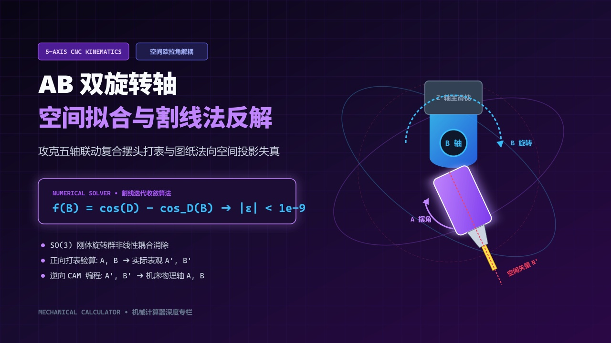
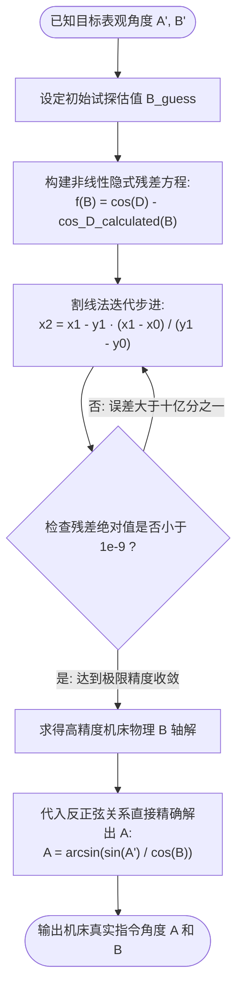
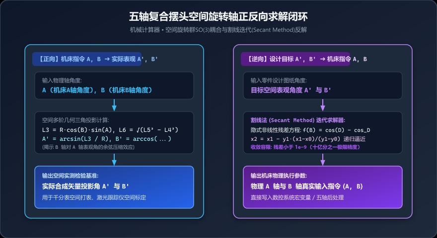

# 五轴机床复合摆头打表总对不上？揭秘空间双旋转轴SO(3)耦合与割线迭代反解



> **导读**：在五轴联动数控加工、空间异形斜孔镗铣以及精密双转台多轴磨削中，几乎所有高阶工艺员都踩过这个“玄学”大坑：图纸上明明标着空间复合倾角 $A = 15^\circ, B = 20^\circ$，你老老实实把机床 A 轴打到 $15^\circ$、B 轴打到 $20^\circ$，结果拿千分表在主轴端一打，实际法向投影角却诡异地偏了零点几度！这是机床精度不行，还是空间几何欺骗了你？本文带你硬核揭秘空间旋转群的非线性投影失真，以及如何利用**割线迭代法（Secant Method）**实现微秒级的正逆向极速拟合！

---

## 一、车间里的“玄学”撞车：空间角度绝非简单标量相加！

在某高端航空零部件制造车间，工件上有一处倾斜 $18.5^\circ$、偏航 $25.0^\circ$ 的精密液压油孔：
* 编程员在数控指令中直接写入：`G00 A18.5 B25.0`；
* 试切后三坐标报告无情亮红灯：**空间孔轴线实际偏向角超差 $0.42^\circ$**！
* 质检员怀疑机床双摆头重复定位超差；机床厂售后拉来激光干涉仪测了一天，机床各单轴精度均在 $\pm 2$ 秒以内，完全合格！

问题出在哪？
**空间三维旋转具有本质上的“非交换性”（Non-commutative）与“非线性投影耦合”**！
在三维空间刚体变换中，先绕 X 轴旋转 $\alpha$、再绕 Y 轴旋转 $\beta$，形成的合成法向矢量在投影平面上的真实夹角，**根本不等于**原始单独旋转的角度！如果你直接拿设计角度去开机床，加工出来的必然是废品。

---

## 二、空间几何图解：双轴旋转下的矢量投影变形

为了直观理解这种空间形变，我们在单位球（半径 $R=1$）内观察一个空间特征法向向量在连续经历 A 轴与 B 轴两次旋转时的空间轨迹：

```text
                     Z 轴 (主轴法向)
                          ▲
                          │     ● P' (最终复合空间位置)
                          │    /
                          │   / 
                          │  /  \
                          │ /    \ L6 (空间位移弦长)
                          │/      \
                          ┼────────● P1 (单轴旋转后中间过渡态)
                         /│
                        / │
                       /  │
                   X  ▼   │
                  (A轴)   └─────────────► Y 轴 (B轴)
```

当空间矢量由初始位置发生偏转时：
1. **第一次旋转**：矢量在局部坐标平面内划出圆弧，生成中间投影分量 $L_1, L_2$；
2. **第二次旋转**：由于空间基准已经发生倾斜，第二次旋转的运动平面已经**不再正交于全局基准面**，导致二次投影分量 $L_3 \sim L_8$ 产生高度非线性的空间交叉畸变；
3. 最终形成在观测参考系下的实际表观投影角 $A'$ 与 $B'$！

---

## 三、数学解析：正向几何推导与逆向数值迭代

### 1. 正向推导：从指令角 $(A, B)$ 到实际空间表观角 $(A', B')$

设单位参考球半径 $R = 1$，将角度转换为弧度制：$A_{rad} = A \cdot \frac{\pi}{180}$，$B_{rad} = B \cdot \frac{\pi}{180}$。

根据空间几何投影截面分解，计算各级几何中间弦长与投影分量：
$$L_1 = R \cdot \cos(B_{rad})$$
$$L_2 = R \cdot \sin(A_{rad})$$
$$L_3 = L_1 \cdot \sin(A_{rad})$$
$$L_4 = L_2 - L_3$$
$$L_5 = 2R \cdot \sin\left(\frac{B_{rad}}{2}\right)$$
$$L_6 = \sqrt{L_5^2 - L_4^2}$$
$$L_7 = \sqrt{R^2 - L_2^2}$$
$$L_8 = \sqrt{R^2 - L_3^2}$$

由此解出在空间检测坐标系下的实际投影倾斜角 $C$（即 $A'$）与 $D$（即 $B'$）：
$$A' = \arcsin\left(\frac{L_3}{R}\right) \times \frac{180^\circ}{\pi}$$
$$B' = \arccos\left(\frac{L_7^2 + L_8^2 - L_6^2}{2 \cdot L_7 \cdot L_8}\right) \times \text{sign}(B) \times \frac{180^\circ}{\pi}$$

> 💡 **关键发现**：$L_3 = R \cos(B) \sin(A)$。注意到没有？实际表观角 $A'$ 竟然受到 $\cos(B)$ 的强烈调制！这意味着 **B 轴转得越大，A 轴的表观投影角度缩水就越严重**！这就是导致车间打表不准的元凶！

---

### 2. 逆向推导：已知图纸目标角度 $(A', B')$，如何反解机床轴控制指令 $(A, B)$？

在实际编程中，图纸只给定了工件最终所需的空间斜角 $A'$ 和 $B'$，我们需要逆向反推机床物理轴应该设定的真实输入值 $A$ 和 $B$。

从上述公式可以看出，由于包含复合平方根、三角函数嵌套与非线性余弦定理，**该方程组根本不存在初等代数显式解析解**！
必须采用高阶数值分析算法求解。

在我们的计算器底层，采用的是计算力学中经典的**割线法（Secant Method）根寻找迭代器**：

<details>
<summary><b>🔍 点击展开查看割线迭代数学求解 Mermaid 代码</b></summary>



</details>

通过微秒级的数值迭代，系统在十亿分之一（$10^{-9}$）的极小误差容限内锁定极值，彻底攻克了传统手工无法求解的代数绝境！

---

## 四、工程全流程决策与调机流程图



<div style="background: #f8fafc; border: 1px solid #e2e8f0; border-radius: 12px; padding: 18px; margin: 16px 0;">
  <div style="font-weight: bold; color: #0f172a; margin-bottom: 12px; font-size: 15px; display: flex; align-items: center; gap: 8px;">
    <span>🔄</span> 五轴空间旋转轴正逆向应用对照指南
  </div>
  <div style="background: #eff6ff; border-left: 4px solid #3b82f6; padding: 12px; border-radius: 6px; margin-bottom: 10px;">
    <div style="font-weight: bold; color: #1d4ed8; font-size: 13px; margin-bottom: 6px;">🔵 正向路径：打表与精度标定</div>
    <div style="font-size: 12px; color: #334155; line-height: 1.6;">
      • <strong>输入：</strong>机床物理轴当前数值 <code>(A, B)</code>；<br/>
      • <strong>输出：</strong>实际合成向量空间投影角 <code>(A', B')</code>；<br/>
      • <strong>用途：</strong>千分表主轴空间打表检测、激光跟踪仪多轴标定，验证机床当前空间姿态。
    </div>
  </div>
  <div style="background: #faf5ff; border-left: 4px solid #a855f7; padding: 12px; border-radius: 6px;">
    <div style="font-weight: bold; color: #7e22ce; font-size: 13px; margin-bottom: 6px;">🟣 逆向路径：数控编程与后处理</div>
    <div style="font-size: 12px; color: #334155; line-height: 1.6;">
      • <strong>输入：</strong>设计图纸标注的目标法向角 <code>(A', B')</code>；<br/>
      • <strong>输出：</strong>机床物理伺服轴必须输入的指令 <code>(A, B)</code>；<br/>
      • <strong>用途：</strong>输入五轴 CAM 后处理模块或数控机床宏程序，消除欧拉角投影耦合失真。
    </div>
  </div>
</div>

<details>
<summary><b>🔍 点击展开查看全流程决策 Mermaid 原生代码</b></summary>


</details>

---

## 五、手把手实操案例演算

我们以一组典型的五轴摆头切削工况进行数据验证：

### 1. 正向计算（从物理轴到表观角）
* **机床输入物理轴角度**：
  * $A = 25.0000^\circ$
  * $B = 35.0000^\circ$
* **计算器运算过程**：
  * 计算 $L_1 = \cos(35^\circ) \approx 0.81915$
  * 计算 $L_3 = 0.81915 \times \sin(25^\circ) \approx 0.34618$
  * 实际投影倾角 $A' = \arcsin(0.34618) \approx 20.2547^\circ$
  * 实际空间偏向角 $B' \approx 36.4385^\circ$
* **震撼对比**：物理轴明明转了 $25^\circ$，空间投影角却衰减到了 **$20.2547^\circ$**，误差高达近 **$4.75^\circ$**！如果不做变换，工件直接报废！

### 2. 逆向拟合（从图纸目标到机床指令）
* **假设图纸要求达到的最终空间几何角度**：
  * $A' = 20.2547^\circ$
  * $B' = 36.4385^\circ$
* **在逆向推算面板中输入并点击计算**：
  * 割线迭代器经过数次自动收敛，瞬间反解出：
  * $A = 25.0000^\circ$
  * $B = 35.0000^\circ$
* **完美闭环**：正逆双向完全无损互通，为五轴精密加工提供了坚实的数据底座！

---

## 六、五轴调机与宏程序编程避坑指南

1. **正负号（象限）的几何意义**：
   * 在使用该算法时，若偏角向负方向偏转（如 $B < 0$），在输入面板中务必带上负号；计算器底层已专门编写了符号传递逻辑，确保空间四象限矢量方向完全正确；
2. **极点奇异区（Singularity）避让**：
   * 当角度接近 $90^\circ$ 时（$\cos B \to 0$），数学上会出现分母趋于零的“万向节死锁”奇异现象。在五轴机床加工中，应尽量避免让摆头工作在 $85^\circ \sim 90^\circ$ 的极限边缘；
3. **机床旋转轴次序（Kinematic Chain）确认**：
   * 不同的五轴机床结构不同（有双转台 A-C、转台摆头 B-C、双摆头 A-B）。本文模型专为**正交串联 A-B 双旋转轴**打造，使用前请确认机床物理轴运动顺序与建模假设一致。

---

## 七、一键在线空间拟合利器

告别厚重的数值分析教材，无需在 MATLAB 里写复杂脚本！
打开我们的**【机械计算器 ➜ AB旋转轴拟合】**：
* 左右双通道布局：左侧直求实际空间投影，右侧秒级反解物理机床角度；
* 底层原生集成割线法收敛引擎，在移动端和电脑端均可毫秒级出解；
* 五轴编程工程师、调机技师必备的案头利器！

👉 **在线计算工具直达**：[https://mechanical-calculator.niekun.net/](https://mechanical-calculator.niekun.net/)

*（在留言区交流：你们车间搞五轴加工时，遇到过最难调的空间角度是哪一种？欢迎分享你的避坑经验！）*

---

#五轴加工 #AB旋转轴 #空间复合角 #数控宏程序 #割线法 #CAM编程 #精密多轴 #打表对刀
