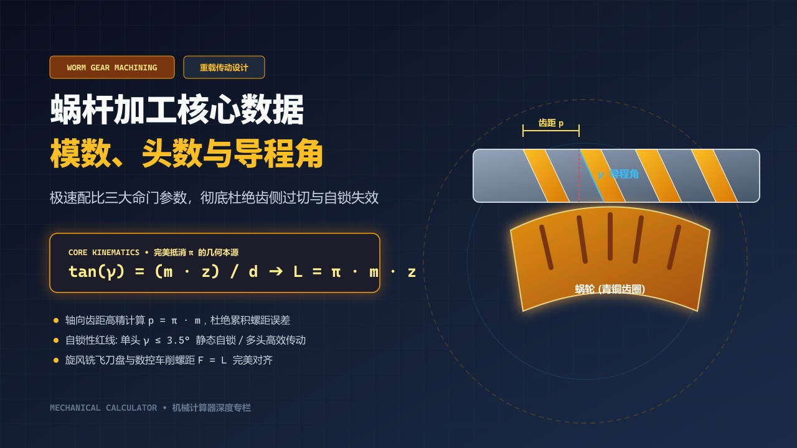
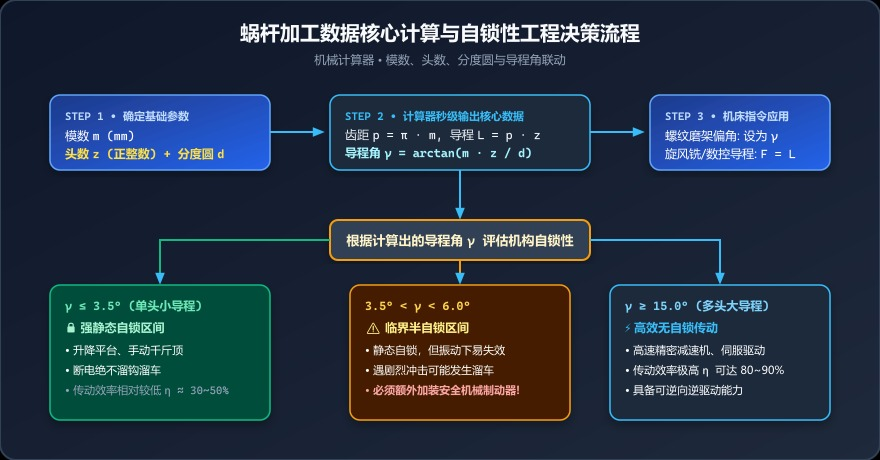
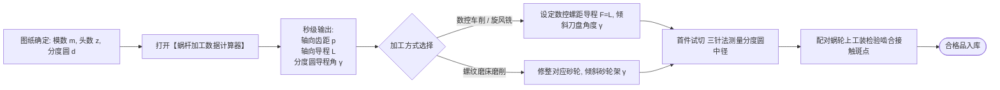

# 模数、头数与分度圆：一键吃透蜗杆加工三大命门，杜绝啮合干涉与跑偏



> **导读**：蜗轮蜗杆减速机构以其巨大的传动比和平稳低噪的啮合特性，广泛应用于电梯、升降机、精密回转台与工程机械中。然而，在旋风铣削、车削和成型磨削蜗杆齿面时，许多工艺员往往被一堆轴向齿距、法向模数、导程与分度圆导程角绕得晕头转向。一旦参数计算稍有偏差，轻则挂轮配错牙距不符，重则装配后剧烈发热咬死、自锁失效发生重物溜坠事故！本文手把手教你厘清蜗杆加工的底层核心数学链。

---

## 一、车间翻车现场：为什么蜗杆加工总在“牙距”和“倾角”上栽跟头？

“明明数控程序里输入的螺距是 $9.42\text{ mm}$，怎么铣刀铣出来一配蜗轮，齿侧接触斑点全集中在端头，转不到半圈就彻底卡死？”

排查原因后发现，这正是典型的概念混乱：
1. 工艺员误把**模数 $m=3$** 对应的轴向齿距 $p = \pi \times 3 \approx 9.4248\text{ mm}$ 简写截断成 $9.42\text{ mm}$ 输入，导致几牙之后**累积螺距误差高达数十微米**；
2. 此外，该蜗杆为**双头（$z=2$）**，机床旋风铣刀盘偏转角应该对齐的是**导程角 $\gamma$**（由导程 $L = 18.8496\text{ mm}$ 决定），他却按单头齿距去算了偏角！刀盘在切削过程中对齿壁产生严重“过切刮伤”，整根蜗杆直接报废。

蜗杆看似只是一根粗壮的“特种螺纹”，但其齿廓曲线对模数、头数与分度圆几何的严苛程度，远超普通紧固螺纹！

---

## 二、几何透视：蜗杆齿形几何结构剖面图

把蜗杆沿轴线剖开，它的纵截面就是一个标准的齿条齿形；而绕在圆柱表面，则是由 $z$ 条螺旋线交织而成的空间螺旋面：

```text
               蜗杆圆柱表面展开与分度圆剖面

       ◄─────────── 轴向齿距 p = π · m ──────────►
       ┌──────┐                              ┌──────┐
       │      │                              │      │
       │      │      齿槽                    │      │
───────┘      └──────────────────────────────┘      └─────── 分度圆柱线 d
       ▲                                     ▲
       │                                     │
       └─────────────────────────────────────┘
                 导程 L = z · p = π · m · z
                 (头数 z = 2 时, 旋转一周轴向位移为 2p)

                      /|
                     / │
                    /  │ 导程 L = π · m · z
                   /   │
                  / γ  │ (分度圆导程角)
                 /_____│
          ◄────── π · d ──────► (分度圆展开周长)
```

### 核心三大基准参数

| 符号 | 参数名称 | 物理意义与车间角色 |
|:---:|:---|:---|
| **$m$** | 模数 (Module, mm) | 齿轮与蜗杆最核心的规格基准，决定齿厚与牙深大小 |
| **$z$** | 头数 / 线数 (Threads) | 蜗杆上的独立螺旋线数量，**必须为严格正整数** ($1, 2, 3, 4\dots$) |
| **$d$** | 分度圆直径 (Diameter, mm) | 蜗杆理论啮合基准圆柱直径，通常 $d \approx q \cdot m$（$q$ 为直径系数） |

---

## 三、数学解析：经典公式链与被“优雅约去”的 $\pi$

### 1. 轴向齿距 $p$（Axial Pitch）
模数制蜗杆的轴向齿距等于标准齿轮分度圆齿距：
$$p = \pi \cdot m\text{ (mm)}$$
* 车间警示：由于 $\pi$ 是无理数，手工计算严禁只保留 $3.14$！必须使用高精度常数计算，避免累积螺距误差。

---

### 2. 轴向导程 $L$（Lead）
导程是指蜗杆旋转一整周（$360^\circ$）时，螺旋线在轴向前进的物理位移：
$$L = z \cdot p = \pi \cdot m \cdot z\text{ (mm)}$$
* 单头蜗杆（$z=1$）：$L = p$（导程等于齿距）；
* 多头蜗杆（$z > 1$）：$L = z \times p$（导程是齿距的正整数倍）。

---

### 3. 分度圆导程角 $\gamma$（Lead Angle）
导程角是蜗杆旋风铣削、螺纹磨削时机床刀架或砂轮轴**必须精准倾斜的角度**。
由直角三角形几何展开关系可知：
$$\tan\gamma = \frac{\text{对边导程 } L}{\text{底边分度圆周长 } \pi d} = \frac{\pi \cdot m \cdot z}{\pi \cdot d}$$

请注意！分子分母中的 $\pi$ 发生**完美对称抵消**：
$$\tan\gamma = \frac{m \cdot z}{d}$$

由此求得导程角 $\gamma$：
$$\gamma = \arctan\left(\frac{m \cdot z}{d}\right) \times \frac{180^\circ}{\pi}$$

> 💡 **重点解析**：
> 无论圆周率 $\pi$ 是多少，分度圆导程角的正切值本质上就等于**（模数 $\times$ 头数）与分度圆直径的比值**！这一优美的数学化简彻底规避了圆周率取舍带来的截断误差！

---

## 四、工程深水区：自锁性判定与加工工艺窗口



<div style="background: #f8fafc; border: 1px solid #e2e8f0; border-radius: 12px; padding: 18px; margin: 16px 0;">
  <div style="font-weight: bold; color: #0f172a; margin-bottom: 12px; font-size: 15px; display: flex; align-items: center; gap: 8px;">
    <span>⚙️</span> 蜗杆导程角与自锁安全工程三阶对照
  </div>
  <div style="background: #ecfdf5; border: 1px solid #a7f3d0; border-radius: 8px; padding: 12px; margin-bottom: 10px;">
    <div style="font-weight: bold; color: #047857; font-size: 13px; margin-bottom: 4px;">🔒 强自锁区 (γ ≤ 3.5°)</div>
    <div style="font-size: 12px; color: #334155; line-height: 1.5;">
      通常为单头小导程。断电静态绝不溜车溜钩，适用于起重机、升降台，传动效率相对较低 (30%~50%)。
    </div>
  </div>
  <div style="background: #fff7ed; border: 1px solid #fed7aa; border-radius: 8px; padding: 12px; margin-bottom: 10px;">
    <div style="font-weight: bold; color: #c2410c; font-size: 13px; margin-bottom: 4px;">⚠️ 临界半自锁区 (3.5° ~ 6.0°)</div>
    <div style="font-size: 12px; color: #334155; line-height: 1.5;">
      静态自锁，但遭遇强振动或交变冲击时可能滑移溜车，必须额外配置机械常闭式制动抱闸！
    </div>
  </div>
  <div style="background: #eff6ff; border: 1px solid #bfdbfe; border-radius: 8px; padding: 12px;">
    <div style="font-weight: bold; color: #1d4ed8; font-size: 13px; margin-bottom: 4px;">⚡ 高效传动区 (γ ≥ 15.0°)</div>
    <div style="font-size: 12px; color: #334155; line-height: 1.5;">
      多头大导程，传动效率高达 80%~90%，具备可逆驱动性，适用于伺服减速机与精密转台。
    </div>
  </div>
</div>

* **自锁条件数学本质**：当导程角 $\gamma$ 小于摩擦副的当量摩擦角 $\rho_v$（钢对青铜润滑良好时通常为 $3^\circ \sim 4.5^\circ$），机构即使受反向载荷也无法倒转；
* **头数选型经验**：要求自锁选单头（$z=1$）；追求动力传动效率选多头（$z=2, 4$）。

---

## 五、车间工艺生产决策流程图

<div style="background: #eff6ff; border: 1px solid #bfdbfe; border-radius: 10px; padding: 16px; margin: 16px 0;">
  <div style="font-weight: bold; color: #1e40af; font-size: 14px; margin-bottom: 8px;">📋 蜗杆生产加工现场三步法</div>
  <div style="font-size: 13px; color: #1e293b; line-height: 1.7;">
    1. <strong>输入基本参数：</strong>在计算器中输入模数 <code>m</code>、正整数头数 <code>z</code>、分度圆直径 <code>d</code>；<br/>
    2. <strong>获取加工基准：</strong>自动输出高精度齿距 <code>p = π · m</code>、导程 <code>L = p · z</code> 与分度圆导程角 <code>γ</code>；<br/>
    3. <strong>机床参数映射：</strong>数控车/旋风铣螺距直接输入 <code>F = L</code>，刀盘或砂轮架精确偏转 <code>γ</code>，首件采用三针法测量分度圆中径。
  </div>
</div>

<details>
<summary><b>🔍 点击展开查看 Mermaid 流程图原生代码</b></summary>



</details>

---

## 六、手把手实操案例演算

以某工业重载减速机中的高品质渐开线蜗杆为例：

* **工况输入数据**：
  * 模数 $m = 4\text{ mm}$
  * 头数 $z = 2$（双头蜗杆）
  * 分度圆直径 $d = 50.000\text{ mm}$

### 1. 轴向齿距计算
$$p = \pi \times m = 3.14159265 \times 4 \approx 12.5664\text{ mm}$$

### 2. 轴向导程计算
$$L = p \times z = 12.56637 \times 2 \approx 25.1327\text{ mm}$$
*（数控车削螺纹时，螺距指令直接输入导程值：`G92 X... Z... F25.1327`）*

### 3. 分度圆导程角计算
$$\tan\gamma = \frac{m \cdot z}{d} = \frac{4 \times 2}{50} = \frac{8}{50} = 0.1600$$
$$\gamma = \arctan(0.1600) \approx 9.0903^\circ$$

* **结论**：
  * 该蜗杆分度圆导程角为 **$9.0903^\circ$**（旋风铣刀盘需倾斜 $9^\circ 5'$）；
  * 导程角大于 $6^\circ$，**该机构不具备静态自锁能力**，若用于起重机械必须配置常闭式制动抱闸！

---

## 七、车间老师傅调机避坑要诀

1. **旋风铣偏刀防干涉**：
   在高速旋风铣削多头蜗杆时，由于飞刀切入和切出轨迹是空间圆弧，必须严格保证铣刀盘中心与蜗杆轴线垂直相交，且偏转角与导程角误差不应超过 $\pm 2'$，否则齿侧必然发生中凹拉毛；
2. **正整数输入防呆**：
   头数 $z$ 必须是正整数（$1, 2, 3\dots$）。任何输入小数或零的情况在物理齿形上都是不存在的。计算器前端已设置严格防呆，杜绝误输入；
3. **法向模数 $m_n$ 与轴向模数 $m_a$ 的转换**：
   对于普通阿基米德蜗杆（ZA型），图纸标的通常为轴向模数 $m = m_a$；若图纸注明为法向模数 $m_n$，则需先通过公式 $m_a = \frac{m_n}{\cos\gamma}$ 换算后代入计算。

---

## 八、一键极速在线运算

别再在现场到处找草稿纸算 $\pi$ 了！
打开我们的**【机械计算器 ➜ 蜗杆加工数据】**：
* 输入**模数、头数、分度圆直径** 3 个基本数据；
* 秒级联动输出：**齿距 $p$、导程 $L$、导程角 $\gamma$**；
* 四位高精度小数呈现，直接用于机床编程和调机对刀，省时、省心、零失误！

👉 **在线计算工具直达**：[https://mechanical-calculator.niekun.net/](https://mechanical-calculator.niekun.net/)

*（各位同行：你们做蜗杆加工通常是用数控车挑扣、旋风铣还是专用蜗杆磨床？欢迎在评论区分享你的加工心得！）*

---

#蜗轮蜗杆 #蜗杆加工 #旋风铣 #螺纹车削 #模数制 #导程角 #机构自锁 #减速机设计
