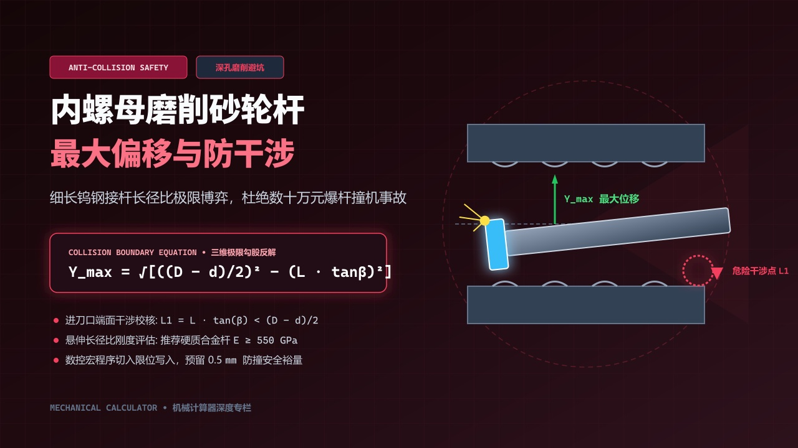
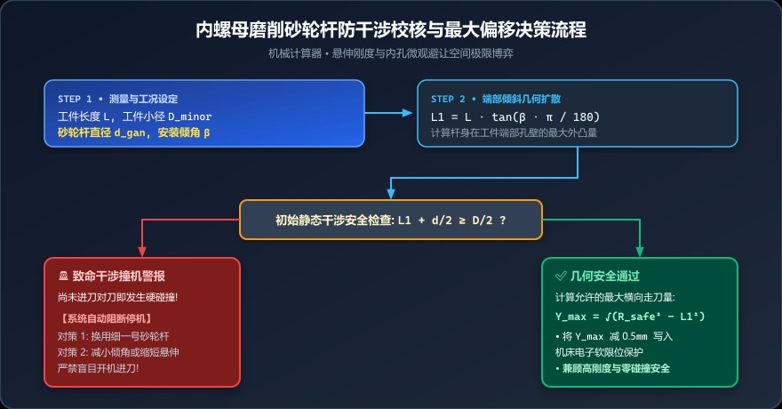
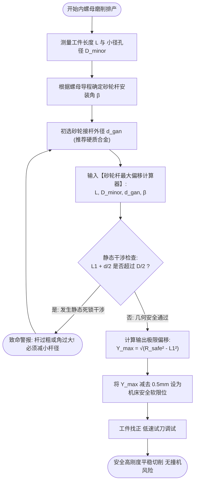

# 内螺母深孔磨削极易爆杆撞刀？一键校核砂轮杆安装倾角与安全偏移极值



> **导读**：在滚珠丝杠螺母（Ball Nut）和深孔多头内螺纹的精密磨削中，车间最让人心惊肉跳的事故莫过于“爆杆撞机”。由于砂轮必须装在细长杆（Quill）顶端伸入狭长内孔，且必须倾斜一个螺旋安装角；调机时如果横向偏移稍大，高速旋转的硬质合金接杆瞬间就会以数万转的速度猛烈撞击工件内孔，造成主轴轴承报废、杆断刀飞！如何在机床开动前，精准计算出砂轮杆在狭小内孔中的**最大允许物理偏移极限**？本文带你一探深孔内磨的极限博弈。

---

## 一、车间惊魂瞬间：刚换的进口电主轴，因一根细长杆当场撞报废

“砰！的一声巨响，火星四溅，整个磨床主轴箱剧烈抖动！”

这是某丝杠厂新上马滚珠螺母内螺纹磨削时经历的一场恶性事故：
* 工件为长度 $L = 80\text{ mm}$、小径 $D_{minor} = 32\text{ mm}$ 的精密螺母；
* 操作工为了追求切削刚度、消除内孔振纹，特意定制了一根粗壮的 $\Phi 20\text{ mm}$ 钨钢砂轮接杆；
* 由于该螺母导程较大，机床砂轮架倾斜了 $\beta = 8.5^\circ$ 的安装倾角；
* 在手动对刀、向侧面微调寻找牙槽切削点时，操作工以为内孔还有不少空间，结果**伸入孔底的粗砂轮杆在倾斜状态下，外壁直接狠狠别在螺母端部小径孔壁上**！价值数十万的高速内磨电主轴瞬间烧死抱死。

深孔内螺母磨削，本质上是在一根悬臂梁的**极限物理刚度**与内孔**极其苛刻的空间干涉避让**之间走钢丝！

---

## 二、几何图解：三维内孔倾斜干涉的三维剖视

为什么倾斜的砂轮杆在内孔中极易发生致命碰撞？我们从工件沿轴线的纵剖面一探究竟：

```text
                        工件端部 (入刀口)                工件孔底 (切削区)
                        ═════════════════════════════════════════════════  ◄── 工件小径孔壁 (D_minor / 2)
                        │               砂轮接杆外缘                    │
                        │             .─────────────────────────────────┼───► 砂轮 (切削点)
                        │           .' 砂轮杆 (直径 d_gan)             │
                        │         .'                                    │
                        │       .' β (安装倾角)                         │
  工件中心轴线 ─────────┼─────.'────────────────────────────────────────┼─────
                        │   .'                                          │
                        │ .' ◄───────────── 工件长度 L ──────────────► │
                        │'                                              │
                        ═════════════════════════════════════════════════  ◄── 工件相对侧孔壁
                        ▲
                        │
                        └─── 杆身最危险碰撞截面点
                             (偏离中心偏移量 L1 = L · tan(β))
```

在三维空间中观察：
1. **倾斜引起轴向偏移扩散**：砂轮杆每向深孔伸入距离 $L$，其杆身外侧在倾斜角度 $\beta$ 作用下，将向侧方突出物理距离：
   $$L_1 = L \cdot \tan\beta$$
2. **截面几何余量急剧压缩**：在工件入口端截面上，原本充裕的圆形内孔，被倾斜延伸的椭圆投影与横向偏移占满；
3. **安全死线**：一旦向单侧偏移过度，砂轮杆侧壁与工件小径内壁相碰，瞬间发生致命空间干涉！

---

## 三、数学解析：干涉判据与最大允许偏移公式推导

### 1. 空间死线校验（临界干涉警报）

在工件长度为 $L$、安装倾角为 $\beta$ 时，杆身末端在轴向投影方向产生的位置偏移量为：
$$L_1 = L \cdot \tan\left(\beta \cdot \frac{\pi}{180^\circ}\right)$$

工件单边小径半径为 $\frac{D_{minor}}{2}$，砂轮杆自身半径为 $\frac{d_{gan}}{2}$。
在中心初始对准状态下，杆身外缘所占的最大空间为 $L_1 + \frac{d_{gan}}{2}$。

如果出现以下情况：
$$L_1 + \frac{d_{gan}}{2} \ge \frac{D_{minor}}{2}$$

> 🔴 **系统级红色警报**：
> 此时哪怕完全不对刀、横向偏移量为零，**砂轮杆在当前倾角下自身就已经插不进工件内孔**！必须立即改小砂轮杆直径、缩短工件伸出悬臂长度或优化安装角度！

---

### 2. 空间最大允许横向偏移 $Y_{max}$ 的勾股推导

当几何条件处于安全区间内时，工件小径圆心与砂轮杆之间构成一个正交二维几何避让圆。

* 理论全向允许的最大安全包络半径为：
  $$R_{safe} = \frac{D_{minor}}{2} - \frac{d_{gan}}{2}$$
* 在倾角方向上，已经预先消耗掉了 $L_1$ 的几何空间；
* 根据正交直角三角形勾股定理，在与该方向垂直的横向切向进刀轴上，所能允许砂轮杆中心偏离工件轴心的**最大绝对极限距离 $Y_{max}$** 为：

$$Y_{max} = \sqrt{\left(\frac{D_{minor}}{2} - \frac{d_{gan}}{2}\right)^2 - L_1^2}\text{ (mm)}$$

> 💡 **重点解析**：
> 这个 $Y_{max}$ 就是数控磨床在进行螺母内滚道对刀、深槽横向摆动切入时，**绝对不可逾越的“电子围栏”安全阈值**！

---

## 四、刚度与干涉的极限博弈（老工程师私房理论）

许多人问：“既然粗杆容易撞，那全换成 $\Phi 6$ 的细杆不就永远不会撞了吗？”

**绝对不行！因为深孔磨削最大的敌人是“弯曲颤振”！**

根据材料力学悬臂梁挠度变形公式：
$$f = \frac{F \cdot L^3}{3 \cdot E \cdot I} \propto \frac{L^3}{E \cdot d_{gan}^4}$$

* 砂轮杆刚度与直径的**四次方（$d^4$）成正比**，与悬伸长度的**三次方（$L^3$）成反比**！
* 杆直径减小一半，在切削抗力下的弯曲变形剧增 **16 倍**！
* 结果就是：砂轮剧烈跳动、工件出现竹节纹、粗糙度极差，甚至砂轮自身被振碎。

因此，深孔内螺母磨削的最高境界是：**利用本计算器算出极限裕量，在保证不干涉的前提下，将砂轮杆粗细做到极值，榨干每一分动刚度！**

---

## 五、车间全流程防撞与调机决策流程图



<div style="background: #f8fafc; border: 1px solid #e2e8f0; border-radius: 12px; padding: 18px; margin: 16px 0;">
  <div style="font-weight: bold; color: #0f172a; margin-bottom: 12px; font-size: 15px; display: flex; align-items: center; gap: 8px;">
    <span>🛡️</span> 内螺母深孔磨削安全防撞三级防护网
  </div>
  <div style="background: #eff6ff; border-left: 4px solid #3b82f6; padding: 12px; border-radius: 6px; margin-bottom: 10px;">
    <div style="font-weight: bold; color: #1d4ed8; font-size: 13px; margin-bottom: 6px;">1. 初始空间静态校核</div>
    <div style="font-size: 12px; color: #334155; line-height: 1.6;">
      计算倾斜外凸量 <code>L1 = L · tan(β)</code>。<br/>
      若 <code>L1 + d/2 ≥ D/2</code>，说明杆身在入口端自身已发生硬碰撞，系统立即红牌阻断，提示减小杆径。
    </div>
  </div>
  <div style="background: #ecfdf5; border-left: 4px solid #10b981; padding: 12px; border-radius: 6px; margin-bottom: 10px;">
    <div style="font-weight: bold; color: #047857; font-size: 13px; margin-bottom: 6px;">2. 极限物理行程秒算</div>
    <div style="font-size: 12px; color: #334155; line-height: 1.6;">
      勾股定律秒算最大允许偏移 <code>Y_max = √(R_safe² - L1²)</code>。<br/>
      明确横向进刀的绝对物理边界，杜绝“凭手感瞎猜偏移量”。
    </div>
  </div>
  <div style="background: #fff7ed; border-left: 4px solid #f97316; padding: 12px; border-radius: 6px;">
    <div style="font-weight: bold; color: #c2410c; font-size: 13px; margin-bottom: 6px;">3. 机床数控软限位设防</div>
    <div style="font-size: 12px; color: #334155; line-height: 1.6;">
      将计算出的 <code>Y_max</code> 减去 0.5mm 安全余量，录入机床电子坐标软限位保护，从底层杜绝调机撞刀。
    </div>
  </div>
</div>

<details>
<summary><b>🔍 点击展开查看 Mermaid 流程图原生代码</b></summary>



</details>

---

## 六、手把手实操案例演算

我们以某精密机床滚珠丝杠螺母（Ball Nut）精磨工况进行验算：

* **工件与工艺输入**：
  * 螺母长度 $L = 45.00\text{ mm}$
  * 螺母小径 $D_{minor} = 28.00\text{ mm}$（内圆半径 $14.00\text{ mm}$）
  * 初选硬质合金砂轮杆直径 $d_{gan} = 16.00\text{ mm}$（杆半径 $8.00\text{ mm}$）
  * 砂轮杆安装倾角 $\beta = 5.0^\circ$

### 1. 检验倾斜端部偏移分量 $L_1$
$$L_1 = 45.00 \times \tan(5^\circ) = 45.00 \times 0.087489 \approx 3.9370\text{ mm}$$

### 2. 静态干涉安全检查
$$L_1 + \frac{d_{gan}}{2} = 3.9370 + 8.0000 = 11.9370\text{ mm}$$
对比小径半径：
$$11.9370\text{ mm} < \frac{28.00}{2} = 14.0000\text{ mm}$$
*（差值尚有约 $2.063\text{ mm}$ 空间，判定初始状态不发生干涉，允许进行下一步计算！）*

### 3. 计算最大允许横向偏移距离 $Y_{max}$
$$R_{safe} = 14.0000 - 8.0000 = 6.0000\text{ mm}$$
$$Y_{max} = \sqrt{R_{safe}^2 - L_1^2} = \sqrt{6.0000^2 - 3.9370^2} = \sqrt{36.0000 - 15.5000} \approx \sqrt{20.5000} \approx 4.5277\text{ mm}$$

* **车间结论**：
  在当前工况下，砂轮杆中心偏离工件轴线的横向行程**绝对不能超过 $4.5277\text{ mm}$**！
  在设定数控系统切入宏程序时，建议将安全限位值写入 $4.00\text{ mm}$ 以内，留出 $0.5\text{ mm}$ 的缓冲防撞安全裕量。

---

## 七、内孔深孔磨削避坑实战口诀

1. **材质必须上硬质合金（钨钢）**：
   在长径比 $L / d > 3$ 的深孔磨削中，严禁用普通 45 号钢或工具钢做接杆！普通钢弹性模量 $E \approx 210\text{ GPa}$，而优质硬质合金 $E \ge 550\sim 600\text{ GPa}$，刚度高出近 3 倍，可大幅降低切削振动；
2. **警惕冷却液回流死角带来的“液力浮起”**：
   小间隙深孔磨削时，高压磨削液灌入孔内如果回流不畅，会在狭窄间隙内形成高压液体动压油膜，把倾斜的细长杆往侧壁猛推，诱发意外碰擦；
3. **调机初次对刀必须降速或手摇轮微动**：
   在没有确定实际安全间隙前，严禁使用快速进给（G00）伸入孔内对刀，必须打到手摇脉冲轮（MPG）$\times 1\,\mu\text{m}$ 挡位慢速试触。

---

## 八、一键使用在线防撞校核工具

在排产出图前，只需几秒钟，就能把几十万元的撞机风险抹杀在萌芽状态！
打开我们的**【机械计算器 ➜ 砂轮杆最大偏移】**：
* 依次输入：**工件长度、工件小径、砂轮杆直径、安装角**；
* 系统内置智能几何干涉阻断机制：一旦参数物理干涉，立即弹窗示警拦截；
* 安全状态下毫秒级算出 **最大允许偏移量**，直观指导现场编程与调机！

👉 **在线计算工具直达**：[https://mechanical-calculator.niekun.net/](https://mechanical-calculator.niekun.net/)

*（在留言区互动：在深孔磨削中，你们遇到过最棘手的长径比是多少？大家平时是如何防止内孔撞刀的？）*

---

#深孔磨削 #滚珠螺母 #砂轮杆刚度 #防撞机 #内孔磨削 #数控调机 #硬质合金刀杆 #机械加工
